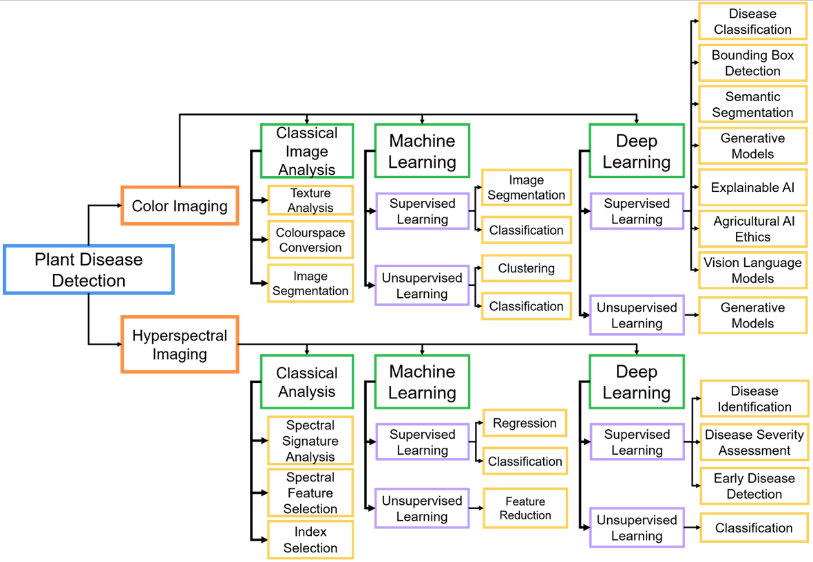
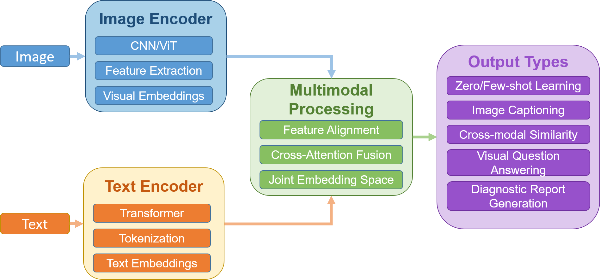
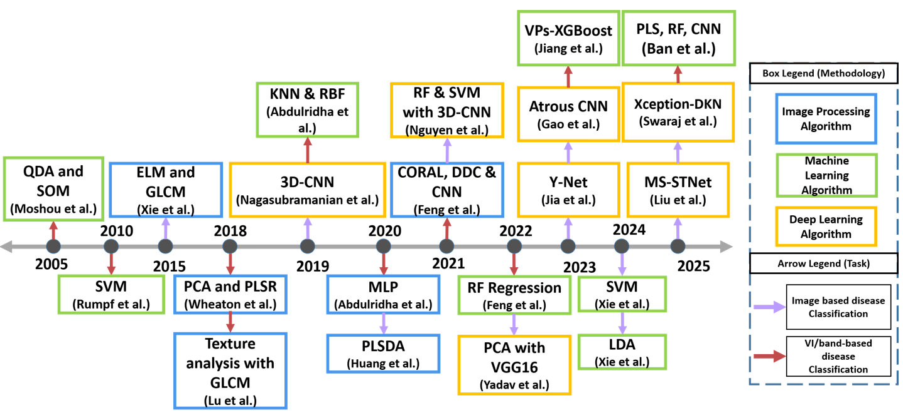

# Recent Advances in Plant Disease Detection: Challenges and Opportunities

This is the official companion repository for the open-access Plant Methods review paper **Recent advances in plant disease detection: challenges and opportunities**. The review synthesizes progress in RGB and hyperspectral imaging for plant disease detection, with emphasis on the gap between laboratory performance and field deployment. This repository provides the paper PDF, LaTeX source, key figures, dataset references, benchmarking resources, and reproducible fine-tuning code for plant disease classification experiments. It is intended to help readers quickly find the datasets, reproduce exploratory benchmarking workflows, and cite the article correctly.

## Quick Links

- [Paper PDF](paper/review_paper.pdf)
- [DOI: 10.1186/s13007-025-01450-0](https://doi.org/10.1186/s13007-025-01450-0)
- [Dataset table](#datasets-from-the-review)
- [Benchmarking script](scripts/finetune_classification.py)
- [Featured figures](#featured-figures)
- [Citation](#citation)

## List of Datasets for Plant Disease Detection

The table below is derived from Table 2 of the paper: "Summary of datasets employed in plant disease detection studies, including details on the environment, size, categories, annotations, characteristics, and challenges." A machine-readable version is available at [`tables/datasets.csv`](tables/datasets.csv), and the dataset-link maintenance table is available at [`docs/dataset_links.md`](docs/dataset_links.md).

| Dataset | Environment | Size | Categories/classes | Annotation type | Key characteristics | Challenges | Link |
| --- | --- | --- | --- | --- | --- | --- | --- |
| PlantVillage | Lab | 54,303 | 38 | Labels | Captured in a lab; single leaf per image; uniform background | Data imbalance; fine-grained classification | [Mendeley Data / original dataset URL](https://data.mendeley.com/datasets/tywbtsjrjv/1) [tensorflow](https://www.tensorflow.org/datasets/catalog/plant_village) |
| PlantDoc | Natural & Lab | 2,569 | 30 | Labels & Bounding Boxes | Field images; some misclassification | Imbalanced data; variability | [GitHub repository](https://github.com/pratikkayal/PlantDoc-Dataset) [github](https://github.com/pratikkayal/PlantDoc-Dataset) |
| Cassava Leaf Disease | Natural | 21,367 | 5 | Labels | Crowd-sourced from farmers | Real-world variability | [Kaggle competition](https://www.kaggle.com/c/cassava-leaf-disease-classification) [kaggle](https://www.kaggle.com/c/cassava-leaf-disease-classification) |
| FieldPlant | Natural | 5,170 | 27 | Labels & Bounding Boxes | Collected from plantations; complex backgrounds | Imbalanced data; cluttered environment | [Roboflow Universe page](https://universe.roboflow.com/plant-disease-detection/fieldplant) [universe.roboflow](https://universe.roboflow.com/plant-disease-detection/fieldplant) |
| CD&S | Natural | 1,597 | 3 | Labels & Bounding Boxes | Field-acquired; augmented images | Disease classification | [arXiv paper / dataset description](https://arxiv.org/abs/2110.12084) [arxiv](https://arxiv.org/abs/2110.12084) |
| JMuBEN | Natural | 58,555 | 5 | Labels | Multiclass classification | Small image resolution | [Mendeley Data](https://data.mendeley.com/datasets/tgv3zb82nd/1) [data.mendeley](https://data.mendeley.com/datasets/tgv3zb82nd/1) |
| Cucumber Disease Dataset | Natural | 6,400 | 8 | Labels | Multiclass classification; augmented images | Fine-grained classification | [Mendeley Data](https://data.mendeley.com/datasets/y6d3z6f8z9.1) [data.mendeley](https://data.mendeley.com/datasets/y6d3z6f8z9) |
| Tobacco Leaf Abnormality | Natural | 1,430 | 16 | Labels | Single disease focus; high-resolution images | Class imbalance; disease similarity | No clear public standalone dataset link found; the dataset is described in the paper, but a direct download link was not surfaced in the sources checked. [pubmed.ncbi.nlm.nih](https://pubmed.ncbi.nlm.nih.gov/38681219/) |
| Tobacco Plant Disease Dataset | Natural | 2,721 | 12 | Labels & Bounding Boxes | Detailed multi-class annotations | Occlusion; fragmented disease recognition | [University publication page](https://research.mpu.edu.mo/en/publications/tobacco-plant-disease-dataset) [research.mpu.edu](https://research.mpu.edu.mo/en/publications/tobacco-plant-disease-dataset) |
| BananaLSD | Natural | 1,600 | 4 | Labels | Field-captured smartphone images; expert pathologist labeling | Three distinct leaf spot diseases; real-world variability | [Kaggle dataset](https://www.kaggle.com/datasets/shifatearman/bananalsd) |
| Banana Leaves Imagery | Natural | 11,767 | 3 | Labels | Multi-regional collection; high-resolution smartphone capture | Geographic diversity; disease severity variation | [Nature article landing page](https://www.nature.com/articles/s41597-025-04456-4) |
| Tanzania Banana Leaf Dataset | Natural | 17,068 | 3 | Labels | Farmer garden collection; camera device standardization | Real-world field variability; mobile image quality consistency | [Dataverse / DOI landing page](https://doi.org/10.7910/DVN/LQUWXW) [ngdc.cncb.ac](https://ngdc.cncb.ac.cn/opia/dataset/datasets/tables?dataId=35) |
| PSFD-Musa Banana Leaf Dataset | Natural | 8,000 | 15 | Labels | Multi-aspect banana health assessment; augmented images | Multi-class identification; diverse disease types | [Kaggle dataset](https://www.kaggle.com/datasets/shifatearman/bananalsd) |
| Makerere AI Bean Disease | Natural | 1,295 | 3 | Labels | Smartphone-captured field images; expert annotation by NaCRRI | Real-world variability; mobile deployment requirements | [GitHub repository](https://github.com/AI-Lab-Makerere/ibean/) [github](https://github.com/Lwhieldon/Cassava-Leaf-Disease-Classification) |
| CGIAR Bean Disease | Natural | 9,969 | 6 | Labels & Bounding Boxes (34,053 micro annotations) | Multi-disease coverage; leaf and pod samples; disease hotspot collection | Complex backgrounds; co-occurring diseases; large-scale variations | [Nature article landing page](https://doi.org/10.1038/s41598-024-66281-w) [data.mendeley](https://data.mendeley.com/datasets/3832tx2cb2/1) |
| AGM_HS | Natural | 6,127 | 2 | Labels & Segmentation | Top-view of crops; segmentation masks | Detection and localization of plant stress | [Hugging Face dataset](https://huggingface.co/datasets/deep-plants/AGM_HS) |
| PlantSeg | Natural | 11,400 | 115 | Labels & Segmentation | In-the-wild images; diverse environments; segmentation masks | Disease region identification and classification | [arXiv paper](https://arxiv.org/abs/2409.04038) and [Zenodo dataset](https://zenodo.org/records/13958858) [arxiv](https://arxiv.org/abs/2409.04038) |

## Featured Figures

### Figure 2: Taxonomy of Plant Disease Detection Literature



Comprehensive taxonomy of existing literature on plant disease detection using color and hyperspectral imaging modalities. The hierarchical structure categorizes detection methodologies into three fundamental approaches: classical image processing, machine learning techniques, and deep learning frameworks, demonstrating the evolutionary trajectory from conventional analytical methods to advanced computational learning paradigms.

### Figure 7: RGB Methodology Timeline



Chronological overview of the most relevant methodologies for plant disease detection. The color of the box represents the classification of methodology while the color of the arrow shows the task performed. The timeline illustrates the progression of machine learning algorithms in plant disease detection, tracing the developments from foundational methods to advanced techniques involving various neural network architectures, highlighted by the interconnected influences and improvements across different studies.

### Figure 10: HSI Methodology Timeline



Chronological overview of the most relevant methodologies for Plant Disease Detection using HSI. The color of the box represents the classification of methodology while the color of the arrow shows the task performed.

## Benchmarking Code

This repository provides a simple Hugging Face/PyTorch benchmarking script inspired by Table 6 of the review: "Classification performance comparison across plant disease datasets. Results are reported as Accuracy/F1-Score. Bold values indicate the best performance for each dataset, while italicized values denote the best result from the Exploratory Analysis." The extracted Table 6 resource is available at [`tables/benchmark_results_table6.csv`](tables/benchmark_results_table6.csv).

The script fine-tunes common image-classification backbones on local image-folder datasets:

| Model option | Hugging Face checkpoint |
| --- | --- |
| `swin` | `microsoft/swin-base-patch4-window12-384` |
| `vit` | `google/vit-base-patch16-224` |
| `convnext` | `facebook/convnext-base-224-22k-1k` |
| `resnet` | `microsoft/resnet-50` |

Expected local dataset layout:

```text
datasets/
  PlantVillage/
    class_1/
    class_2/
  FieldPlant/
  PlantDoc/
  CroppedPlantDoc/
```

Run one model on one dataset:

```bash
python scripts/finetune_classification.py --model swin --dataset PlantVillage --data-root datasets --epochs 10 --batch-size 16
```

Run all supported models on all supported datasets:

```bash
python scripts/finetune_classification.py --model all --dataset all --data-root datasets --epochs 10 --batch-size 16
```

Outputs are written to `results/`, including per-run text files, confusion matrices, label mappings, configuration files, and a combined `results/benchmark_summary.csv`.

## Repository Structure

```text
.
|-- README.md
|-- LICENSE
|-- CITATION.cff
|-- requirements.txt
|-- .gitignore
|-- paper/
|   |-- review_paper.pdf
|   `-- source/
|-- figures/
|   |-- figure_2_taxonomy.png
|   |-- figure_7_rgb_timeline.png
|   |-- figure_10_hsi_timeline.png
|   `-- README.md
|-- tables/
|   |-- datasets.csv
|   |-- benchmark_results_table6.csv
|   `-- README.md
|-- scripts/
|   |-- finetune_classification.py
|   `-- README.md
|-- results/
|   `-- README.md
`-- docs/
    |-- dataset_links.md
    |-- citation.ris
    `-- contribution_guide.md
```

## Citation

Please cite the open-access Plant Methods article using the DOI.

```bibtex
@article{Shafay2025PlantDiseaseDetection,
title={Recent advances in plant disease detection: challenges and opportunities},
author={Shafay, Muhammad and Hassan, Taimur and Owais, Muhammad and Hussain, Irfan and Khawaja, Sajid Gul and Seneviratne, Lakmal and Werghi, Naoufel},
journal={Plant Methods},
volume={21},
number={1},
pages={140},
year={2025},
doi={10.1186/s13007-025-01450-0},
url={https://doi.org/10.1186/s13007-025-01450-0}
}
```

RIS citation is available at [`docs/citation.ris`](docs/citation.ris).

## License

The repository code is released under the MIT License. See [`LICENSE`](LICENSE).

The paper itself is open access and should be cited using the DOI. The PDF states that the article is licensed under a Creative Commons Attribution-NonCommercial-NoDerivatives 4.0 International License (CC BY-NC-ND 4.0).
